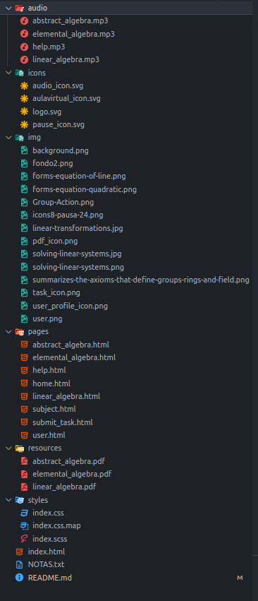

# Documentación Técnica - Aula Virtual
https://markdown.es/
## Portada

**Título del Proyecto:** Aula Virtual con Tailwind CSS  
**Integrantes del Equipo:**  
- Lucas Chacón - Rol diseñador y programador 
- Lucas Sánchez - Rol diseñador y programador
**Fecha de Entrega:** 16/02/2025

---

## Índice
1. Introducción  
2. Arquitectura del Proyecto  
3. Diseño del Proyecto  
4. Tecnologías Utilizadas  
5. Integración de Contenido Multimedia  
6. Responsividad y Accesibilidad  
7. Desafíos y Soluciones  

---

## Introducción
### Descripción del aula virtual
El proyecto consiste en el desarrollo de una plataforma de aula virtual enfocada en brindar una experiencia interactiva y accesible para los usuarios. Se implementó utilizando Tailwind CSS para un diseño moderno y eficiente.

### Objetivos del Proyecto
- Desarrollar una plataforma fácil de usar para la gestión de cursos en línea.
- Implementar un diseño responsivo y accesible.
- Optimizar el rendimiento y la carga de recursos multimedia.

### Alcance del desarrollo en esta etapa
La primera versión del aula virtual incluye:
- Página de inicio con información sobre cursos.
- Registro e inicio de sesión de usuarios.
- Sección de materiales didácticos y multimedia.

---

## Arquitectura del Proyecto
### Estructura de carpetas y archivos
```
/aula-virtual
│── /public
│   │── index.html
│   │── /assets
│       │── logo.png
│── /src
│   │── /components
│   │── /styles
│   │── main.css
│   │── app.js
│── /config
│── package.json
│── tailwind.config.js
```



### Dependencias utilizadas
- **Tailwind CSS**: Framework CSS para estilos rápidos y personalizados.
- **DaisyUI**: Extensión de componentes para Tailwind.
- **Vite**: Herramienta de desarrollo rápida.

---

## Diseño del Proyecto
### Descripción del diseño inicial en Figma
Se crearon prototipos en Figma para definir la estructura visual, con especial énfasis en la usabilidad y navegación intuitiva.

### Traducción del diseño al código
Se usó Tailwind CSS para replicar el diseño de Figma, permitiendo una implementación eficiente con clases reutilizables.

---

## Tecnologías Utilizadas
- **HTML5**: Para la estructura del contenido.
- **CSS (Sass)**: Para el diseño y personalización adicional.
- **Tailwind CSS**: Framework de utilidades para estilos rápidos y flexibles.
- **JavaScript**: Para interactividad y dinámica en la plataforma.

---

## Integración de Contenido Multimedia
### Tipos de contenido multimedia incluidos
- Imágenes en formatos optimizados (WebP, PNG, JPG).
- Videos incrustados desde plataformas como YouTube y Vimeo.
- Documentos PDF y archivos descargables.

### Gestión y optimización de estos recursos
- Uso de lazy loading para mejorar el rendimiento.
- Compresión de imágenes sin perder calidad.
- Carga diferida de videos para evitar bloqueos en la navegación.

---

## Responsividad y Accesibilidad
### Adaptación del diseño a dispositivos móviles y escritorio
- Uso de clases de Tailwind para diseño adaptable (flex, grid, media queries).
- Optimización para diferentes resoluciones y tamaños de pantalla.

### Medidas de accesibilidad aplicadas
- Uso de etiquetas semánticas en HTML.
- Contrastes adecuados en colores y tipografía.
- Compatibilidad con lectores de pantalla.

---

## Desafíos y Soluciones
### Problemas encontrados durante el desarrollo y soluciones
- **Problema:** Dificultades con la configuración inicial de Tailwind.  
  **Solución:** Se revisó la documentación y se ajustó la configuración en `tailwind.config.js`.

- **Problema:** Carga lenta de contenido multimedia.  
  **Solución:** Se implementó lazy loading y optimización de archivos.

- **Problema:** Adaptabilidad a diferentes dispositivos.  
  **Solución:** Se usaron clases responsivas de Tailwind y pruebas en distintos tamaños de pantalla.

---

## Conclusión
El desarrollo del aula virtual con Tailwind CSS ha permitido construir una plataforma moderna, optimizada y accesible. Se lograron implementar buenas prácticas de desarrollo y diseño, garantizando una experiencia de usuario intuitiva y eficiente.

